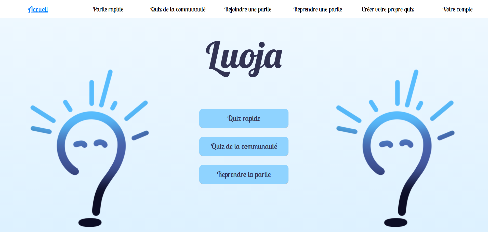
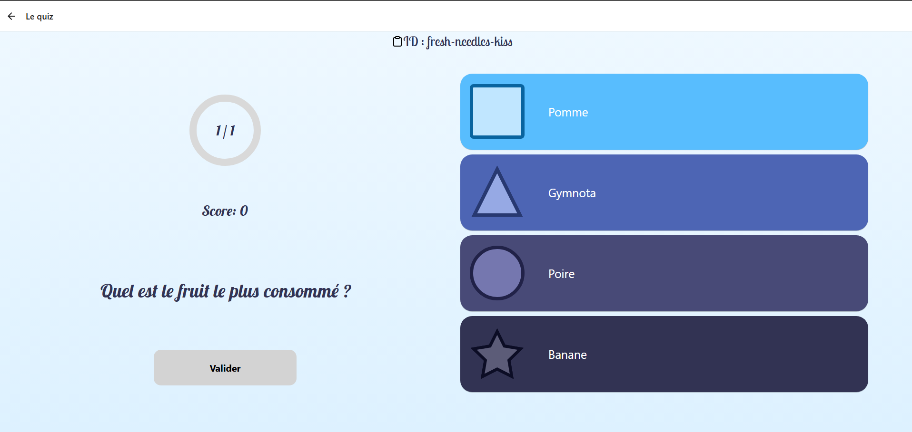

# Baldur - Interface WEB et Mobile

## Collaborateurs

Cette application à été développé par par notre équipe de projet constitué d'élèves de 3ème année de BUT informatique à l'IUT Robert-Schuman d'Ilkirch en 2024-2025 :

- Guillaume Behr (https://github.com/guillaume-behr)
- Saif Zouaoui-mahjoub
- Samuel Marsault (https://github.com/SamuelMarsault)
- Mattéo Gillig
- Théo Willem
- Miniotti Robin (https://github.com/Robin3711)


## Description


Ce projet est une application web et mobile permettant de jouer à des quiz.







### Fonctionnalités


- Jouer à des quiz

- Choisir différents modes de jeu (Standard, Compte à rebours, Scrum, Team)

- Jouer avec des questions textuelles, audios et avec images

- Gestion des utilisateurs

- Voir son tableau de bord lorsqu’on est connecté

- Voir son historique des parties jouées

- Voir les statistiques des quiz que l'on a créé

- Créer des quiz

- Créer des questions (texte, audio et image)

- Ajouter des images et des audios (et pouvoir les supprimer)

- Générer des réponses (textuelles) avec une intelligence artificielle


## Installation


### Production


Le projet est déployé sur un serveur OVH.


### Développement


Pour développer le projet, il est nécessaire d'avoir NodeJS installé sur le poste ainsi que les outils NPM.


Pour installer NodeJS, suivez les instructions sur le site officiel : [https://nodejs.org/en/download/](https://nodejs.org/en/download/)


Ensuite, installez les outils NPM avec la commande suivante (dans le dossier app):


```bash
npm install
```


Une fois les outils installés, il est possible de lancer le projet en mode développement avec la commande suivante :


```bash
npm start
```


Le projet est alors accessible à l'adresse [http://localhost:8081](http://localhost:8081).


Vous pouvez également utiliser l'application Expo Go pour essayer l'application sur votre téléphone. Vous aurez juste à scanner le QR Code présent dans le terminal où le projet a été démarré.


## Utilisation


Le projet est accessible à l'adresse [https://luoja.fr](https://luoja.fr).


Vous pouvez jouer en n'étant pas connecté en cliquant sur le bouton Quiz Rapide, vous pouvez alors configurer les paramètres selon vos désirs et jouer.


Sinon, vous devez vous connecter pour avoir accès aux autres fonctionnalités. Sur web, vous pouvez cliquer sur le bouton Votre compte dans la barre de navigation. Sur mobile, vous trouverez le bouton dans le menu qui se trouve en haut à gauche.


Une fois connecté, vous pouvez créer un quiz à l'aide du bouton Créer votre propre quiz. Cette fonctionnalité est disponible uniquement sur web ! Vous pouvez soit importer des questions déjà existantes, soit créer les vôtres à l'aide des boutons prévus à cet effet. Vous pouvez définir un thème et une difficulté. Ces paramètres serviront de filtre pour les joueurs voulant jouer aux quiz créés par la communauté.


Vous pouvez jouer aux quiz créés par la communauté en cliquant sur le bouton Quiz de la communauté, vous pouvez filtrer les quiz selon le thème ou encore la difficulté.


Une fois le quiz choisi, vous pouvez choisir un mode de jeu selon votre envie. Le mode standard est le mode par défaut qui est présent pour les quiz rapides. Pour plus de difficulté, vous pouvez jouer en mode Compte à rebours, qui ajoutera du temps pour répondre à chaque question.


Si vous voulez jouer avec vos amis, vous avez deux modes disponibles. Tout d'abord le mode Scrum, où le premier joueur à donner la bonne réponse gagne un point, et le joueur ayant le plus de points à la fin de la partie gagne. Et enfin, le mode Team. Ce mode permet, comme son nom l'indique, de jouer en équipe : plusieurs équipes s'affrontent, chaque équipe joue normalement la partie. À la fin de la partie, l'équipe ayant le plus de points gagne.


Pour les modes multijoueurs, lorsque vous créez la partie, vous aurez un code et un QR Code que vous pouvez transmettre à vos amis ; ils permettent de rejoindre la partie. Pour rejoindre la partie, vous pouvez cliquer sur Rejoindre une partie. Sur mobile, vous avez le choix de soit rejoindre soit par le code, soit par le scan du QR Code ; sur la version web, le seul moyen pour rejoindre est le code. Ensuite, le créateur de la partie pourra lancer la partie.


## Commande de lancement de l'image WEB en dev


```bash
sudo docker run -it -p 4000:4000 --name baldur docker.luoja.fr/baldur
```


## Commande de lancement de l'image WEB en production


```bash
sudo docker run -d --restart always --name baldur --network internal_network \

-e PROTOCOL=HTTPS \

-e DOMAIN=luoja.fr \

-e API=api.luoja.fr \

-v /etc/letsencrypt:/etc/letsencrypt:ro \

docker.luoja.fr/baldur
```


## CI/CD : Organisation du Pipeline :


L'objectif du pipeline de ce projet est de corriger le code et de déployer régulièrement

des versions stables de l'application.


La finalité est de n'avoir sur dev et les branches suivantes que du code propre et fonctionnel,

et d'avoir à tout moment des applications web et android prêtes à être déployées.


#### stages :

1. build :

 - build de l'apk pour le mobile et de de l'image docker pour le web.

 - réalisé à chaque commit sur main ou release pour avoir une version prête à déployer.

 - image docker stockée sur le dépot docker de l'équipe.

 - apk envoyé vers les artefacts du pipeline.


2. lint et tests :

 - linting et tests unitaires du code.

 - réalisé à chaque commit sur la branche dev pour vérifier que le code marche encore.

 - résultats affichés dans les pages.

3. pages :

 - affiche les résultats du linting et des tests.


